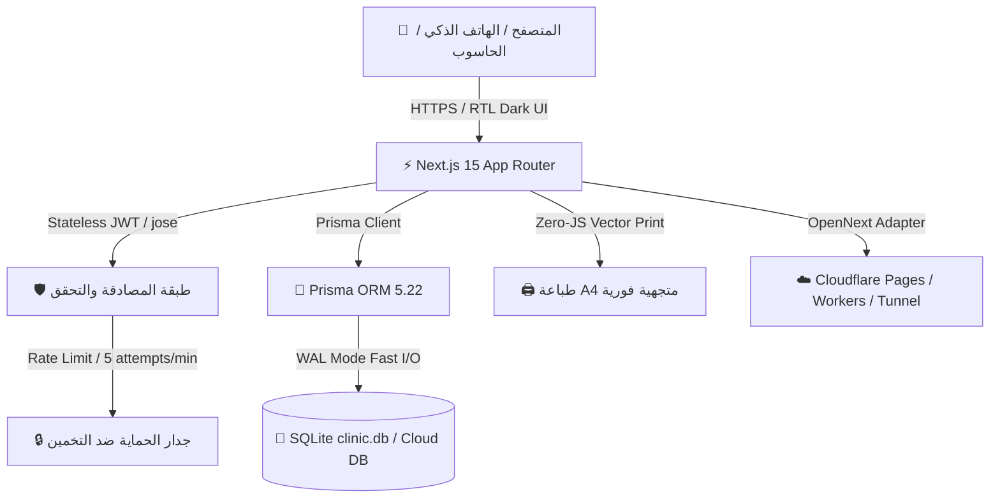
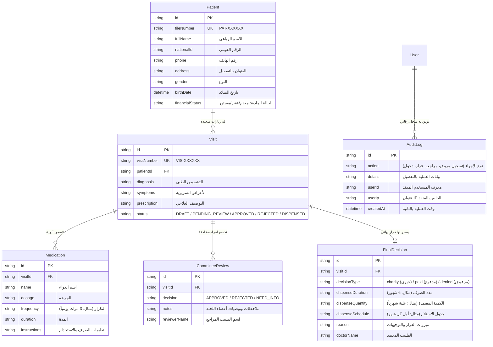
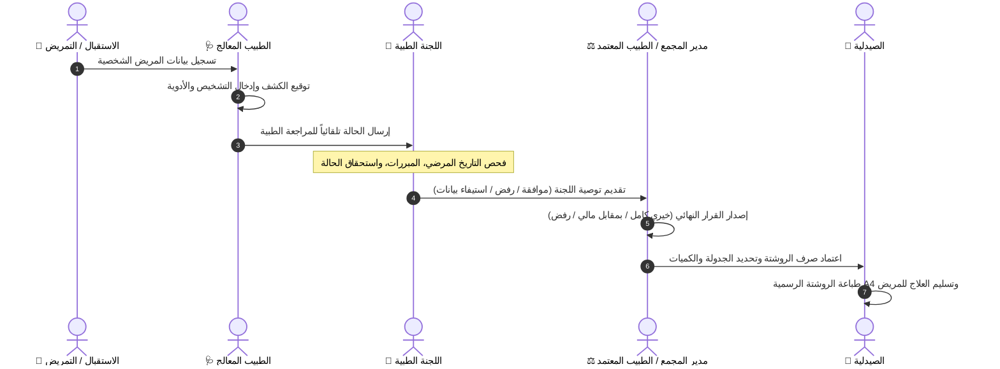

# 🏥 وثيقة المشروع الشاملة | Medical Complex System Documentation
> **نظام إدارة حالات المجمع الطبي والمساعدات العلاجية**  
> **Repository:** [https://github.com/am21951691-cloud/System](https://github.com/am21951691-cloud/System)  
> **Status:** Production-Ready | 0 Vulnerabilities | Fully Optimized for Mobile & Desktop

---

## 📑 جدول المحتويات (Table of Contents)
1. [نظرة عامة والهدف من النظام (Executive Summary)](#1-نظرة-عامة-والهدف-من-النظام-executive-summary)
2. [المعمارية البرمجية وحزمة التقنيات (Tech Stack & Architecture)](#2-المعمارية-البرمجية-وحزمة-التقنيات-tech-stack--architecture)
3. [هيكلة ونماذج قاعدة البيانات (Database Schema & Models)](#3-هيكلة-ونماذج-قاعدة-البيانات-database-schema--models)
4. [دورة العمل الإجرائية والطبية (Clinical & Operational Workflow)](#4-دورة-العمل-الإجرائية-والطبية-clinical--operational-workflow)
5. [واجهة المستخدم ودعم الهواتف الذكية (UI/UX & Mobile Ergonomics)](#5-واجهة-المستخدم-ودعم-الهواتف-الذكية-uiux--mobile-ergonomics)
6. [محرك الطباعة المتجهية والتقارير (Vector A4 Print Engine)](#6-محرك-الطباعة-المتجهية-والتقارير-vector-a4-print-engine)
7. [منظومة الأمان والتحصين (Security Hardening & Protection)](#7-منظومة-الأمان-والتحصين-security-hardening--protection)
8. [كل ما تم إنجازه بالكامل ("All Did")](#8-كل-ما-تم-إنجازه-بالكامل-all-did)
9. [كل ما هو متبقي وخارطة الطريق ("All Still")](#9-كل-ما-هو-متبقي-وخارطة-الطريق-all-still)
10. [دليل النشر والتشغيل على Cloudflare (Deployment Guide)](#10-دليل-النشر-والتشغيل-على-cloudflare-deployment-guide)

---

## 1. نظرة عامة والهدف من النظام (Executive Summary)

**نظام إدارة حالات المجمع الطبي (Medical Complex System)** هو منصة ويب متطورة مصممة خصيصاً لإدارة الجمعيات الخيرية والمجمعات الطبية والمراكز العلاجية. يهدف النظام إلى ضبط وتوثيق رحلة المريض بالكامل من لحظة دخوله للاستقبال وحتى صدور القرار الطبي النهائي وصرف الدواء، مع منع الازدواجية وإحكام الرقابة الإدارية والمالية.

### الأهداف المحققة:
* **فصل ملف المريض عن الزيارة (`Patient ≠ Visit`):** الاحتفاظ بسجل مرضي دائم لكل مريض مع إمكانية إضافة زيارات متعددة عبر الزمن.
* **إجراءات تسجيل سريعة ومتكاملة:** تسجيل بيانات المريض والكشف وقائمة الأدوية دفعة واحدة من شاشة واحدة.
* **دورة اعتماد ثلاثية:** (استقبال/طبيب معالج ⬅️ لجنة مراجعة طبية مستقلة ⬅️ قرار صرف نهائي معتمد).
* **أعلى معايير الخفة والأداء:** زمن تحميل فوري وحجم حزم جافاسكربت لا يتجاوز 103KB.
* **تجربة لمس متكاملة على الهواتف الذكية:** أزرار ضخمة مريحة للمس السريع لمنع الأخطاء البشرية.

---

## 2. المعمارية البرمجية وحزمة التقنيات (Tech Stack & Architecture)



### المكونات البرمجية الأساسية:
| المكون | التقنية المستخدمة | الإصدار | الوظيفة |
| :--- | :--- | :--- | :--- |
| **Framework** | Next.js (App Router) | `15.5.26` | بناء صفحات وتطبيقات الويب السريعة بتقنية React Server Components |
| **Frontend UI** | React | `19.0.0` | بناء الواجهات الديناميكية الحديثة وإدارة النماذج التفاعلية |
| **Styling** | Pure Vanilla CSS Design System | Custom Modern Dark | سمة داكنة فاخرة، توافق RTL كامل، متغيرات HSL، بدون حزم خارجية ثقيلة |
| **Typography** | Google Fonts (Noto Sans Arabic) | Standard Web Font | خط عربي أنيق وواضح جداً للقراءة والطباعة الطبية |
| **ORM** | Prisma ORM | `5.22.0` | نمذجة البيانات والتعامل مع قاعدة البيانات بكفاءة وأمان كامل ضد SQL Injection |
| **Database** | SQLite (clinic.db) | 3.x | قاعدة بيانات محلية سريعة وخفيفة جداً، مع إمكانية التبديل إلى PostgreSQL أو Cloudflare D1 |
| **Authentication** | `jose` (WebCrypto API) | `5.9.6` | جلسات JWT مشفرة بدون خادم (Stateless)، متوافقة 100% مع بيئات الـ Edge |
| **Password Hashing**| `bcryptjs` | `3.0.3` | تشفير كلمات مرور المستخدمين بأعلى درجات التمليح (Salt Rounds) |
| **Edge Adapter** | `@opennextjs/cloudflare` | `0.5.8` | تحويل مشروع Next.js للعمل بكفاءة على شبكة Cloudflare العالمية |

---

## 3. هيكلة ونماذج قاعدة البيانات (Database Schema & Models)

تم تصميم قاعدة البيانات عبر [schema.prisma](file:///d:/System/prisma/schema.prisma) بطريقة علائقية متقدمة تحقق الفصل السليم بين الهوية الشخصية للمريض وسجلاته العلاجية:



---

## 4. دورة العمل الإجرائية والطبية (Clinical & Operational Workflow)

يمر كل مريض برحلة واضحة وموثقة تضمن النزاهة والسرعة:



---

## 5. واجهة المستخدم ودعم الهواتف الذكية (UI/UX & Mobile Ergonomics)

حرصنا على جعل النظام فائق السلاسة وسهل الاستخدام لطواقم الاستقبال والأطباء سواء عبر الحواسيب أو الهواتف الذكية:

* **أزرار لمس كبيرة وضخمة (Touch Targets 48px - 54px):**
  - جميع الأزرار والروابط التفاعلية تم تكبيرها لتكون مريحة جداً للإبهام ومنع الضغط الخاطئ أثناء العمل السريع.
* **منع التكبير التلقائي المزعج على الآيفون (No iOS Auto-Zoom):**
  - جميع حقول الإدخال (`input`, `select`, `textarea`) تم ضبط خطها عند `16px` كحد أدنى، مما يمنع متصفح Safari على iOS من تكبير الشاشة إجبارياً عند كل نقرة.
* **بطاقات إحصائية متجاوبة (Responsive 2x2 Grid):**
  - لوحة المتابعة تتحول تلقائياً على الشاشات الصغيرة إلى شبكة كروت متراصة واضحة دون أي شريط تمرير أفقي.
* **أزرار اختيار ملونة وبارزة للقرار النهائي:**
  - تم تحويل اختيار نوع القرار إلى بطاقات بصرية ملونة (🟢 خيري مجاني / 🔵 مدفوع بتكلفة / 🔴 رفض الصرف) بارتفاع يتجاوز 110px مع توضيح صريح لكل خيار.
* **إدخال الأدوية بديناميكية تامة:**
  - زر `+ إضافة دواء آخر` وزر `🗑️ حذف` مصممان بأحجام لمسية سهلة ومريحة لإضافة أي عدد من الأدوية بلمسة واحدة.

---

## 6. محرك الطباعة المتجهية والتقارير (Vector A4 Print Engine)

تم استبدال مكتبات إنشاء الـ PDF التقليدية المعقدة والبطيئة (`jspdf`, `html2canvas`) بمحرك طباعة متطابق مع معايير الويب النظيفة:

1. **الطباعة المتجهية الصافية (Native CSS Vector Print):**
   - الاعتماد على كود CSS `@media print` الخاص بصفحة `A4`.
   - النصوص تخرج من الطابعة بجودة متجهية فائقة الوضوح (Crisp Vector Quality) بدون أي تشويش (Pixelation) أو بهتان.
2. **تقرير الزيارة والروشتة الفردية (`/visits/[id]/print`):**
   - ترويسة رسمية للمجمع الطبي.
   - بيانات المريض ورقم الملف.
   - تفاصيل الكشف والتشخيص الطبي.
   - جدول الأدوية المعتمدة (الاسم، الجرعة، التكرار، المدة، التعليمات).
   - قرار الصرف المعتمد والشروط والكميات المحددة.
   - صناديق التوقيع الرسمية (توقيع الطبيب المعالج، توقيع اللجنة الطبية، خاتم المجمع، وتوقيع الصيدلي المستلم).
3. **تقرير السجل الشامل للمريض (`/patients/[id]/print`):**
   - يتيح طباعة أرشيف كامل للمريض بضغطة زر واحدة يضم كافة زياراته السابقة وقرارات الصرف المتتالية لمراجعة تاريخه العلاجي.
4. **توفير الحجم وسرعة الاستجابة:**
   - إلغاء مكتبات PDF وفر أكثر من **350 كيلوبايت** من كود الجافاسكربت الذي كان يتم تحميله للمتصفح، وأصبحت نافذة الطباعة تفتح خلال أجزاء من الثانية.

---

## 7. منظومة الأمان والتحصين (Security Hardening & Protection)

تم تدقيق النظام وفق أعلى المعايير الأمنية المعتمدة لتطبيقات الرعاية الصحية:

* **فحص الثغرات الحزمي (Zero Vulnerabilities):**
  - نتيجة فحص `npm audit` الرسمية: **0 ثغرات أمنية (0 vulnerabilities)**.
* **حماية ضد هجمات القوة الغاشمة والتخمين (Brute-Force Rate Limiting):**
  - ملف [src/lib/rate-limit.ts](file:///d:/System/src/lib/rate-limit.ts) يراقب عناوين الـ IP ويمنع محاولات تسجيل الدخول المتكررة (بحد أقصى 5 محاولات لكل دقيقة).
* **إدارة الجلسات المشفرة بدون خادم (Stateless JWT):**
  - استخدام مفاتيح HMAC-SHA256 المشفرة عبر مكتبة `jose` المتوافقة مع الـ WebCrypto API، مما يمنع تزوير الجلسات تماماً.
* **حماية كلمات المرور (Salted Hashes):**
  - تخزين كلمات المرور مشفرة بواسطة خوارزمية `bcryptjs`، ولا يتم تخزين أي نص كلمة مرور صريح إطلاقاً.
* **منع ثغرات حقن الاستعلامات (SQL Injection Prevention):**
  - جميع العمليات على قاعدة البيانات تمر عبر استعلامات مُعاملة (Parameterized Queries) مبنية تلقائياً داخل Prisma ORM.
* **سجل الرقابة والأحداث (Audit Trail):**
  - تسجيل آلي وتلقائي لكل حدث حساس (تسجيل مريض، إضافة زيارة، تعديل، مراجعة لجنة، قرار نهائي، تسجيل دخول وخروج) مع الـ IP والمستخدم والوقت.

---

## 8. كل ما تم إنجازه بالكامل ("All Did")

فيما يلي حصر دقيق لكافة المهام والتطويرات والتحسينات التي تم إنجازها واختبارها واعتمادها:

### 🔒 أولاً: الأمان والحماية البرمجية
- [x] إجراء فحص أمني شامل للحزم والتبعيات وحل كافة التحذيرات حتى الوصول إلى **0 Vulnerabilities**.
- [x] استئصال المكتبات المهملة والمليئة بالثغرات مثل `jspdf`, `jspdf-autotable`, و `html2canvas`.
- [x] إعداد نظام حماية من التخمين (Rate Limiting) على مسار تسجيل الدخول `src/app/api/auth/login/route.ts`.
- [x] استبدال استدعاءات `node:crypto` القديمة بمكتبة `jose` المتوافقة عالمياً مع Edge Runtime والمتصفحات.
- [x] توحيد التحقق من صلاحيات المدير (`ADMIN`) وإلغاء التعقيدات غير المستغلة.

### 🧹 ثانياً: تنظيف وترتيب الكود المصدري (Code Clean-up)
- [x] حذف أكثر من 3,500 سطر من الأكواد المهملة والمكررة ومسودات التطوير القديمة.
- [x] حذف ملفات التصدير القديمة غير النظيفة واستبدالها بنظام الطباعة المباشر النقي.
- [x] إزالة التعارضات بين أسماء المشاريع في `package.json` و `wrangler.jsonc` لضبط بناء Cloudflare.
- [x] توحيد تنسيقات الـ TypeScript والتأكد من خلو المشروع تماماً من أي خطأ لغوي أو تضارب في الأنواع (`npx tsc --noEmit` يعطي 0 أخطاء).

### 🩺 ثالثاً: تكامل الدورة السريرية والوظيفية
- [x] **توحيد شاشة إضافة المريض الجديد (`/patients/new`):** أصبحت تسجل (بيانات المريض + الكشف الطبي + قائمة الأدوية التفاعلية) بنقرة زر واحدة وتوجه الحالة آلياً للمراجعة الطبية.
- [x] **تحديث وإصلاح لوحة المتابعة (`/dashboard`):** إصلاح تصفية المرضى بتبويب `?status=patients` ومطابقة الأرقام الإحصائية مع الواقع.
- [x] **إضافة خيارات التنقل السريع:** روابط سهلة في ملف المريض لإضافة زيارة جديدة، تعديل البيانات، وطباعة السجل الأرشيفي الشامل.
- [x] **تطوير محرك إدخال الأدوية (`MedicationForm.tsx`):** إضافة وحذف تفاعلي فوري للأدوية والجرعات والتكرار والتعليمات.

### 📱 رابعاً: ملاءمة الهواتف الذكية والأجهزة اللوحية
- [x] ترقية كافة أزرار النظام إلى ارتفاعات لمسية تتراوح بين `48px` و `54px`.
- [x] تصميم أزرار القرار النهائي للطبيب على شكل بطاقات لمس ضخمة ملونة وملفتة للنظر.
- [x] معالجة مقاسات حقول الإدخال لتفادي مشكلة التكبير المفاجئ في متصفحات الهواتف المحمولة.
- [x] إعادة توزيع كروت الإحصائيات في لوحة التحكم لتظهر في شبكة متناسقة (2x2) على شاشات الجوال.

### ☁️ خامساً: إعدادات Cloudflare والمستودع البرمجي
- [x] إضافة ملفات الضبط `wrangler.jsonc` و `open-next.config.ts`.
- [x] حل خطأ الارتباط الذاتي للمشروع `WORKER_SELF_REFERENCE: medical-complex-system which was not found (Error 10143)`.
- [x] ربط قاعدة بيانات **Cloudflare D1** (`clinic-db` بمعرف `010ca23d-e436-404b-8e50-3e42f98ac091`) وتثبيت المحول `@prisma/adapter-d1` وتوليد ترحيل الجداول `migrations/0001_init.sql`.
- [x] توثيق خطوات تشغيل نفق Cloudflare Tunnel الآمن للمستشفيات والمراكز الطبية.
- [x] مزامنة الكود ورفعه على مستودع GitHub على الفرعين `main` و `master`.

---

## 9. كل ما هو متبقي وخارطة الطريق ("All Still")

هذه قائمة بالخطوات التنفيذية المتبقية لتدشين النظام في بيئة الإنتاج الفعلي، مع مقترحات اختيارية للتطوير المستقبلي:

### 🚀 1. المتطلبات التنفيذية الفورية لإطلاق الإنتاج (Production Launch)
- [ ] **اختيار استراتيجية تشغيل قاعدة البيانات:**
  - **الخيار الموصى به للمجمعات (Cloudflare Tunnel + Local SQLite):**
    تشغيل السيرفر على جهاز كمبيوتر داخل المجمع الطبي واستخدام أداة `cloudflared` لربطه بنطاق إنترنت عالمي. هذا الخيار مجاني 100%، فائق السرعة، ولا يتطلب أي قاعدة بيانات سحابية خارجية، ويضمن بقاء بيانات المرضى محفوظة داخل المنشأة.
  - **الخيار البديل (Cloudflare Pages + Serverless DB):**
    في حال الرغبة في تشغيل النظام بالكامل كخدمة سحابية بدون أي خادم محلي، يجب ربط Prisma بقاعدة بيانات سحابية مدعومة (مثل: **Neon PostgreSQL** المجانية أو **Supabase** أو **Cloudflare D1** مع إضافة محول `@prisma/adapter-d1`).
- [ ] **تعيين المتغيرات البيئية السرية (Production Environment Variables):**
  - تعيين قيمة قوية وعشوائية للمتغير `JWT_SECRET` (مثال: توليده عبر `openssl rand -hex 32`).
  - ضبط `NODE_ENV=production`.
- [ ] **تغيير كلمة المرور الافتراضية للحساب الإداري:**
  - الحساب الافتراضي حالياً هو `admin` / `admin123`. يجب تغيير كلمة المرور أو إنشاء حساب طبيب جديد رسمي فور التثبيت عبر الأمر:
    ```bash
    npx tsx scripts/add-user.ts doctor_admin "StrongPassword@2026" "د. المدير الطبي"
    ```

### 💾 2. النسخ الاحتياطي وحماية البيانات (Backups & Maintenance)
- [ ] **جدولة النسخ الاحتياطي التلقائي لملف قاعدة البيانات:**
  - إعداد أمر مجدول (Cron Job على لينكس أو Task Scheduler على ويندوز) لنسخ ملف `data/clinic.db` يومياً في مجلد نسخ احتياطي خارجي أو رفعه مشفراً إلى خدمة سحابية (مثل Cloudflare R2 أو Google Drive).

### 💡 3. تحسينات وتطويرات مقترحة للمستقبل (Phase 2 Roadmap)
- [ ] **إضافة رمز التحقق الرقمي السريع (QR Code):**
  - توليد رمز QR ديناميكي في ترويسة الروشتة المطبوعة يتيح للصيدلي مسح الكود بهاتفه للتحقق المباشر من صحة الروشتة ومنع تزوير الأختام.
- [ ] **تصدير التقارير الشهرية إلى Excel / CSV:**
  - إضافة زر لتحميل جدول الحالات المعتمدة والمصروفة شهرياً لمطابقة الحسابات وتقديم التقارير للمتبرعين ومجلس إدارة الجمعية.
- [ ] **إشعارات الرسائل القصيرة / واتساب (SMS / WhatsApp Integration):**
  - إرسال رسالة نصية تلقائية للمريض تفيده بجاهزية وصرف علاجه الشهري.
- [ ] **نظام إدارة مخزون الصيدلية (Pharmacy Inventory):**
  - ربط الصرف تلقائياً برصيد المخزن الفعلي للأدوية لخصم الكميات المنصرفة وتنبيه مسؤولي العهدة عند قرب نفاد دواء معين.

---

## 10. دليل النشر والتشغيل على Cloudflare (Deployment Guide)

### 🌟 الطريقة المثلى (Cloudflare Tunnel - صفر تكلفة وأعلى أمان):
1. قم بتشغيل النظام على خادم المجمع:
   ```bash
   npm run build
   npm run start
   ```
2. ثبّت برنامج Cloudflare Tunnel:
   ```bash
   winget install Cloudflare.cloudflared
   ```
3. أطلق النفق فوراً:
   ```bash
   cloudflared tunnel --url http://localhost:3000
   ```
4. ستحصل على رابط عالمي محمي بشهادة SSL وحماية متقدمة من هجمات الحرمان من الخدمة (DDoS Protection) مع الحفاظ الكامل على سرية بيانات المرضى داخل شبكتك المحلية.

---
**تم إعداد هذا التقرير الشامل لتوثيق كامل تفاصيل النظام، ما تم إنجازه، وما هو مطلوب لبيئة العمل الفعلية.**
